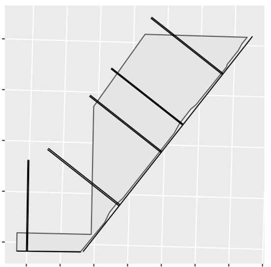
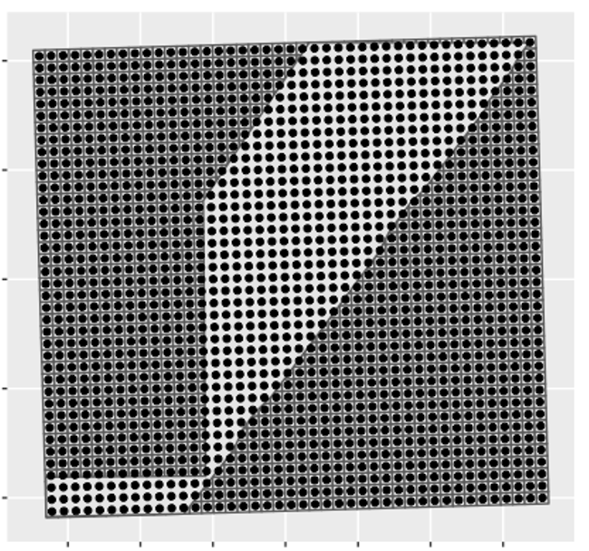
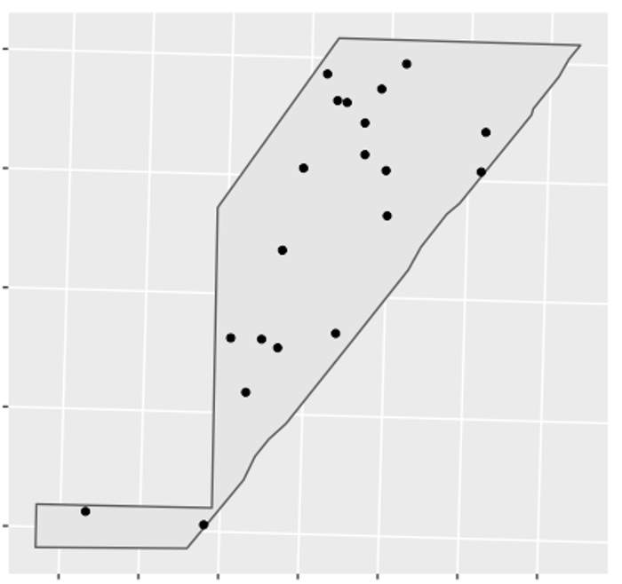

<!-- README.md is generated from README.Rmd. Please edit that file -->

```{r, include = FALSE}
knitr::opts_chunk$set(
  collapse = TRUE,
  comment = "#>",
  fig.path = "man/figures/README-",
  out.width = "100%"
)
```

# SampleBuilder
Paul Hegedus

<!-- badges: start -->
<!-- badges: end -->

The goal of SampleBuilder is to help in generating sampling designs. SampleBuilder has functions for building transects, gridded systematic points, and random points. 

## Installation

You can install the most up to date version of SampleBuilder from [GitHub](https://github.com/) with:

``` r
# install.packages("devtools")
devtools::install_github("paulhegedus/SampleBuilder")
```

## Make Transects Example

This is a basic example which shows you how to build transects for a line layer:

```{r, eval = FALSE}
library(SampleBuilder)

## Make Transects
t_lines <- make_transects(
  line_layer_path = "/Path/To/The/Line/Layer/Filename.shp",
  t_number = 10, # 10 transects
  t_length = 1000, # l000m transect length
  t_size = 10, # 10m x 10m transect cells
  buddy_t = TRUE, # each transect has a buddy
  direction = "positive", # transects only built to the N or W of line layer
  allow_overlaps = FALSE # overlaps of transects are allowed
)

## Make Points along Transects
t_pts <- make_transect_pts(t_lines, 1000, 10)

## Create Sampling Info - data.frame with 'name', 'type', and 'default' cols
sampling_info <- data.frame(
  name = c("date", "observer", "comment1", "comment2", "comment3", "comment4", "comment5"),
  type = rep("character", 7),
  default = rep(NA, 7)
)

## Add Sampling Information to File
t_lines_wInfo <- add_info(t_lines, sampling_info)
t_pts_wInfo <- add_info(t_pts, sampling_info)

## Save Transect Lines and Points
sf::st_write(t_lines_wInfo, "/Path/To/Save/Location/And/Filename.shp")
sf::st_write(t_pts_wInfo, "/Path/To/Save/Location/And/Filename.shp")

```

```{r, out.width='100%', fig.align='center', fig.cap='**Figure 1.** Example of 10 1km transects only in the positive direction. Each of the 5 transects visible have a buddy transect that is between 1 and 3 transect widths from the other for efficient sampling.', echo = FALSE}

```


## Make Grid Example

This is a basic example of how to build a gridded sampling design for an area:

```{r, eval = FALSE}
library(SampleBuilder)

## Make Grid
grid_dat <- make_grid(poly_layer_path = "/Path/To/The/Poly/Layer/Filename.shp",
                      cell_size = 61) # in meters (~200 feet)

## Get Centroids of grid
grid_centroids <- get_centroids(grid_dat)

## Create Sampling Info - data.frame with 'name', 'type', and 'default' cols
sampling_info <- data.frame(
  name = c("date", "observer", "comment1", "comment2", "comment3", "comment4", "comment5"),
  type = rep("character", 7),
  default = rep(NA, 7)
)

## Add Sampling Information to File
grid_pts_wInfo <- add_info(grid_centroids, sampling_info)

## Save Grid and Points
sf::st_write(grid_dat, "/Path/To/Save/Location/And/Filename.shp")
sf::st_write(grid_pts_wInfo, "/Path/To/Save/Location/And/Filename.shp")
```

```{r, out.width='100%', fig.align='center', fig.cap='**Figure 2.** Example of 200 foot grid cells with centroid locations for sampling.', echo = FALSE}

```

## Make Random Points Example

This is a basic example of how to build random points across an area:

```{r, eval = FALSE}
library(SampleBuilder)

## Get Area Boundary
poly_dat <- get_data("/Path/To/The/Poly/Layer/Filename.shp")

## Get Random Samples across Polygon
rand_pts <- sp::spsample(x = as(poly_dat, "Spatial"), 
                         n = 18,  
                         type = "random") %>% 
  sf::st_as_sf()

## Create Sampling Info - data.frame with 'name', 'type', and 'default' cols
sampling_info <- data.frame(
  name = c("date", "observer", "comment1", "comment2", "comment3", "comment4", "comment5"),
  type = rep("character", 7),
  default = rep(NA, 7)
)

## Add Sampling Information to File
rand_pts_wInfo <- add_info(rand_pts, sampling_info)

## Save Transect Lines and Points
sf::st_write(rand_pts_wInfo, "/Path/To/Save/Location/And/Filename.shp")
```

```{r, out.width='100%', fig.align='center', fig.cap='**Figure 3.** Example of random point sampling (note that SampleBuilder not really needed).', echo = FALSE}

```


