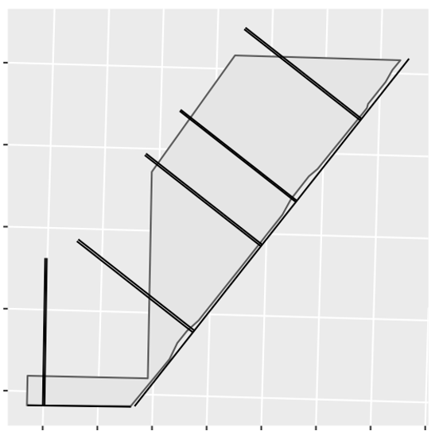

<!-- README.md is generated from README.Rmd. Please edit that file -->

# SampleBuilder

<!-- badges: start -->

<!-- badges: end -->

The goal of SampleBuilder is to help in generating sampling designs.
SampleBuilder has functions for building transects, gridded systematic
points, and random points.

## Installation

You can install the most up to date version of SampleBuilder from
[GitHub](https://github.com/) with:

``` r
# install.packages("devtools")
devtools::install_github("paulhegedus/SampleBuilder")
```

## Make Transects Example

This is a basic example which shows you how to build transects for a
line layer:

``` r
library(SampleBuilder)

## Make Transects
transect_lines <- make_transects(
  line_layer_path = "/Path/To/The/Line/Layer/Filename.shp",
  t_number = 10, # 10 transects
  t_length = 1000, # l000m transect length
  t_size = 10, # 10m x 10m transect cells
  buddy_t = TRUE, # each transect has a buddy
  direction = "positive", # transects only built to the N or W of line layer
  allow_overlaps = FALSE # overlaps of transects are allowed
)

## Save
sf::st_write(transect_lines, "/Path/To/Save/Location/And/Filename.shp")
```

<div class="figure" style="text-align: center">



<p class="caption">

**Figure 1.** Example of 10 1km transects only in the positive
direction. Each of the 5 transects visible have a buddy transect that is
between 1 and 3 transect widths from the other for efficient sampling.

</p>

</div>

## Make Grid Example

This is a basic example of how to build a gridded sampling design for an
area:

``` r
# library(SampleBuilder)
## basic example code
```

## Make Random Points Example

This is a basic example of how to build random points across an area:

``` r
# library(SampleBuilder)
## basic example code
```
